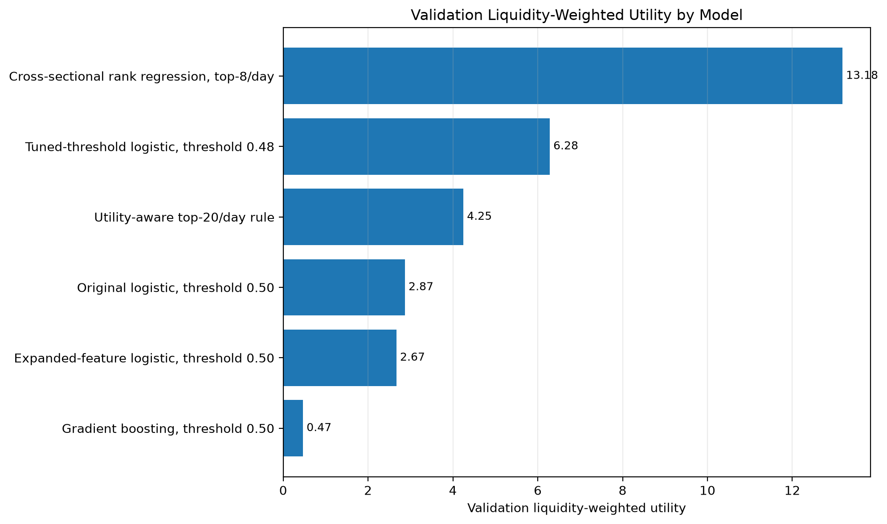
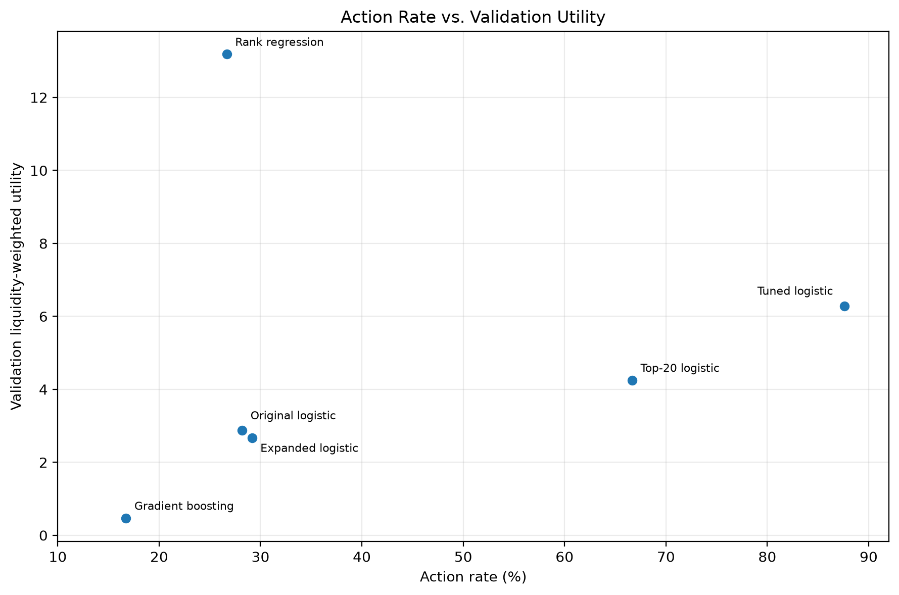
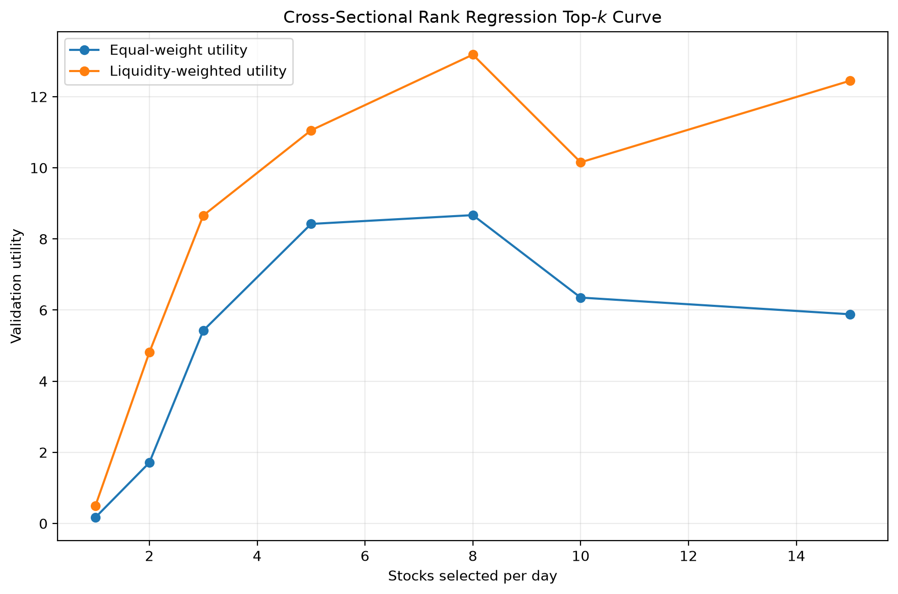

# Jane Street–Inspired Market Prediction

This project adapts the idea of the Jane Street Market Prediction Kaggle competition into a public-data quant research project.

The original competition data is no longer available through this project, so this repository uses daily OHLCV data for a curated universe of liquid U.S. stocks. The goal is to predict next-day stock performance relative to SPY, evaluate execute/pass decisions with an adapted utility score, and document a disciplined modeling process from simple baselines to a more effective cross-sectional ranking model.

## Quick Links

| Reader Goal | Start Here |
|---|---|
| Understand the full modeling story | [`docs/modeling_experiment_summary.md`](docs/modeling_experiment_summary.md) |
| See the final result | [Key Result](#key-result) |
| Understand the prediction task | [`docs/modeling_problem.md`](docs/modeling_problem.md) |
| Understand the utility score | [`docs/utility_score.md`](docs/utility_score.md) |
| Review the final model rationale | [`docs/cross_sectional_rank_regression_design.md`](docs/cross_sectional_rank_regression_design.md) |
| Reproduce the pipeline | [Reproducing the Project](#reproducing-the-project) |
| Browse the source code | [`src/js_market_prediction/`](src/js_market_prediction/) |

## Key Result

The strongest candidate was a cross-sectional rank-regression model with a top-8-per-day selection rule.

| Model / Rule | Validation Equal-Weight Utility | Validation Liquidity-Weight Utility | Action Rate | Mean Response Taken |
|---|---:|---:|---:|---:|
| Original logistic, threshold 0.50 | 0.000000 | 2.870843 | 0.281836 | -0.000298 |
| Tuned-threshold logistic, threshold 0.48 | 1.289191 | 6.283775 | 0.876114 | 0.000145 |
| Expanded-feature logistic, threshold 0.50 | 0.175228 | 2.670977 | 0.291550 | 0.000127 |
| Gradient boosting, threshold 0.50 | 0.000000 | 0.468004 | 0.167265 | -0.000208 |
| Utility-aware top-20/day rule | 0.132720 | 4.248294 | 0.666667 | 0.000057 |
| Cross-sectional rank regression, top-8/day | 8.670413 | 13.182533 | 0.266667 | 0.000926 |

The final model produced the highest validation utility while selecting only 8 of 30 stocks per day. This was a more convincing result than earlier improvements that raised utility mainly by taking a much larger share of the universe.

The main modeling lesson was that binary classification was not the best framing for the final decision. The strongest result came from learning a daily cross-sectional ranking of opportunities.





## How to Read This Repository

For a quick overview, read this README and the key result table above.

For the full modeling story, read [`docs/modeling_experiment_summary.md`](docs/modeling_experiment_summary.md).

For technical details, start with:

* [`docs/modeling_problem.md`](docs/modeling_problem.md) — target, response, prediction timing, and action framing;
* [`docs/utility_score.md`](docs/utility_score.md) — adapted utility framework;
* [`docs/cross_sectional_rank_regression_design.md`](docs/cross_sectional_rank_regression_design.md) — final model rationale.

For reproducibility, see [Reproducing the Project](#reproducing-the-project).

## Reproducing the Project

Create and activate a Python environment, then install the project in editable mode:

```powershell
python -m pip install -e .
```

Core pipeline order:

```powershell
python -m js_market_prediction.data.download
python -m js_market_prediction.data.build_modeling_dataset
python -m js_market_prediction.features.build_features
python -m js_market_prediction.data.build_splits
python -m js_market_prediction.models.run_non_ml_baselines
python -m js_market_prediction.models.run_logistic_regression_baseline
python -m js_market_prediction.evaluation.score_baseline_utilities
python -m js_market_prediction.features.build_expanded_features
python -m js_market_prediction.models.run_cross_sectional_rank_regression
```

Some intermediate experiment scripts can be run separately; see the source files in [`src/js_market_prediction/models/`](src/js_market_prediction/models/).

Generated data files are not tracked in Git. The repository tracks source code, configuration files, notebooks, and documentation.

## Why This Is Jane Street–Inspired

The original Jane Street competition framed market prediction as a decision problem rather than a simple accuracy contest. A model must decide whether to take or pass on each opportunity, and the scoring framework rewards positive, consistent selected responses.

This project follows that spirit while using public data:

* each row is a stock-date observation;
* the response is next-day stock return minus next-day SPY return;
* the action is an execute/pass decision;
* evaluation uses an adapted utility score based on selected weighted responses.

See [`docs/project_scope.md`](docs/project_scope.md) and [`docs/utility_score.md`](docs/utility_score.md) for more detail.

## Data

The dataset uses daily adjusted OHLCV data from `yfinance`.

The modeling universe contains 30 liquid U.S. stocks plus SPY as the benchmark. SPY is used to construct market-relative returns but is not treated as a tradable stock in the modeling dataset.

The final raw dataset covers trading dates from 2016 through 2025.

See [`docs/data_dictionary.md`](docs/data_dictionary.md) for column definitions.

## Prediction Task

For each stock `j` on date `t`, the project computes:

```math
\text{resp\_1d}_{j,t}
=
\text{stock\_return\_1d\_forward}_{j,t}
-
\text{spy\_return\_1d\_forward}_{t}.
```

The initial binary target is:

```text
target_1d = 1 if resp_1d > 0 else 0
```

This means the baseline classification task asks whether the stock will outperform SPY over the next close-to-close interval.

The final model reframes this into a ranking task by predicting each stock's daily cross-sectional percentile rank of future `resp_1d`.

See [`docs/modeling_problem.md`](docs/modeling_problem.md) for the full problem definition.

## Evaluation

The main comparison metric is validation liquidity-weighted utility.

The utility score is adapted from the Jane Street competition's scoring philosophy. It rewards strategies that produce positive selected response while considering daily consistency.

Equal-weight utility is also reported as a sanity check because liquidity-weighted results can differ meaningfully from broad stock-date performance.

The project also tracks:

* total profit;
* daily-profit volatility;
* action rate;
* mean response taken;
* equal-weight utility;
* liquidity-weighted utility.

See [`docs/baseline_metrics.md`](docs/baseline_metrics.md), [`docs/utility_score.md`](docs/utility_score.md), and [`docs/utility_weight_comparison.md`](docs/utility_weight_comparison.md).

## Modeling Path

The project deliberately moved from simple to more sophisticated approaches.

1. **Non-ML baselines**  
   Always pass, always take, and a 20-day momentum rule.

2. **Logistic-regression baseline**  
   A simple classifier using leakage-safe features.

3. **Threshold tuning**  
   Tested whether the logistic model's default `0.50` action threshold was appropriate.

4. **Expanded features**  
   Added market-relative, trend, volatility, volume, liquidity, and cross-sectional rank features.

5. **Gradient-boosting classifier**  
   Tested whether a nonlinear classifier improved the baseline.

6. **Utility-aware top-<var>k</var> rule**  
   Ranked stocks by logistic-regression probability and selected the top `k` names per day.

7. **Cross-sectional rank regression**  
   Reframed the task around daily opportunity ranking and selected the top 8 names per day.

The most important modeling lesson was that binary classification was not the best framing for the final decision. The strongest result came from learning a cross-sectional ranking of daily opportunities.



See [`docs/modeling_experiment_summary.md`](docs/modeling_experiment_summary.md) for the full modeling story.

## Limitations

This project is a research and portfolio project, not a live trading system.

Important limitations include:

* public daily OHLCV data only;
* small universe of 30 liquid U.S. stocks;
* no transaction costs or slippage;
* no market-impact modeling;
* no borrow constraints;
* no portfolio construction layer;
* no walk-forward retraining in the current version;
* an adapted utility score rather than real trading P&L;
* a meaningful train-validation gap in the final model.

Positive validation and test results should be interpreted as evidence of a promising modeling direction, not proof of a deployable trading strategy.

## Repository Structure

```text
configs/                      Project configuration files
data/                         Ignored generated datasets
docs/                         Project documentation
notebooks/                    Exploratory notebooks
src/js_market_prediction/     Source code
tests/                        Lightweight validation scripts
```

## Documentation Guide

Start here:

* [`docs/modeling_experiment_summary.md`](docs/modeling_experiment_summary.md) — full modeling story;
* [`docs/modeling_problem.md`](docs/modeling_problem.md) — target and prediction setup;
* [`docs/utility_score.md`](docs/utility_score.md) — adapted utility framework;
* [`docs/cross_sectional_rank_regression_design.md`](docs/cross_sectional_rank_regression_design.md) — final model rationale.

Supporting experiment notes:

* [`docs/baseline_results.md`](docs/baseline_results.md)
* [`docs/threshold_tuning_results.md`](docs/threshold_tuning_results.md)
* [`docs/expanded_feature_results.md`](docs/expanded_feature_results.md)
* [`docs/gradient_boosting_results.md`](docs/gradient_boosting_results.md)
* [`docs/utility_aware_action_rule_results.md`](docs/utility_aware_action_rule_results.md)

## Project Status

The main modeling development is complete.

Remaining polish work includes final documentation cleanup, GitHub rendering checks, and presentation visuals.
