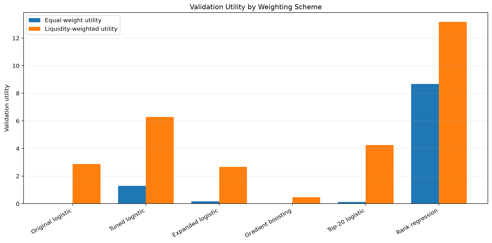
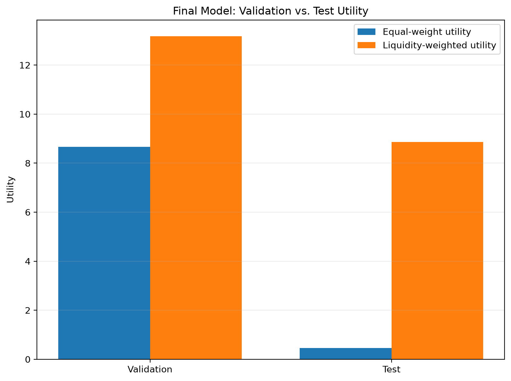

# Modeling Experiment Summary

This document summarizes the main modeling experiments in the Jane Street–inspired market prediction project.

The goal of these experiments was not to prove that a simple public-data strategy is tradable. The goal was to build a disciplined research pipeline, test controlled modeling changes, and identify whether any version of the framework could learn a useful signal for selecting next-day SPY-relative opportunities.

## Starting Point

The initial modeling problem was framed as a binary execute-or-pass decision.

For each stock-date observation, the model predicts whether the stock will outperform SPY over the next close-to-close trading interval. The response variable is `resp_1d`, defined as the stock's next-day return minus SPY's next-day return.

The initial machine-learning baseline used logistic regression with a small feature set built from recent returns, volatility, intraday range, overnight gap, volume, dollar volume, and relative volume.

The project also included simple non-ML reference strategies:

* always pass;
* always take;
* take when 20-day momentum is positive.

These baselines established a comparison point before testing more elaborate models or action rules.

## Evaluation Framework

The main comparison score is validation liquidity-weighted utility.

Equal-weight utility is also reported as a sanity check. This is important because a strategy can look attractive under liquidity weighting while performing poorly across the broader set of stock-date observations.

The most important companion diagnostics to these utility scores are:

* total profit;
* daily-profit consistency;
* action rate;
* mean response taken.

The validation split is used for model and rule comparison. The test split is reserved for final reporting context.

## Controlled Improvement Experiments

The first improvement experiments tested one major change at a time.

### Probability Threshold Tuning

The original logistic-regression baseline used the default `0.50` probability threshold.

Threshold tuning tested whether the same model could perform better under a different execute/pass cutoff. The best validation threshold was `0.48`.

This improved validation utility substantially, but it also made the model much less selective. The tuned-threshold model took approximately `87.6%` of validation opportunities.

This result showed that action-rule choice matters, but it did not fully solve the selection problem.

### Expanded Features

The expanded-feature experiment added 32 leakage-safe features to the original 9-feature set, producing 41 total model features.

The added features included market-relative returns, additional trend measures, volatility and range features, volume and liquidity features, and cross-sectional rank features.

The expanded-feature logistic model improved some diagnostics, including equal-weight behavior, but it did not improve validation liquidity-weighted utility relative to the original logistic baseline.

This suggested that adding more features alone was not enough.

### Gradient Boosting Classifier

The gradient-boosting classifier tested whether a nonlinear tree-based model could improve results using the original feature set.

The model was more selective than logistic regression, but its selected opportunities were not better on average. It also showed a large train-validation gap.

This suggested that nonlinear classification alone did not solve the main weakness of the baseline framework.

### Utility-Aware Top-<var>k</var> Rule

The utility-aware action-rule experiment ranked stocks each day by logistic-regression probability and selected the top $k$.

The best rule selected the top 20 stocks per day. This improved validation liquidity-weighted utility relative to several earlier baselines, but it still selected two-thirds of the daily universe.

This result suggested that the logistic-regression probabilities contained some broad ranking signal, but the model was not especially good at isolating only the best few opportunities.

## Main Failure Mode

The early experiments revealed a consistent pattern.

The easiest improvements came from changing action rules rather than from changing the underlying prediction model. Threshold tuning and top-<var>k</var> selection improved utility, but they did so by taking broad exposure to much of the universe.

That created a problem for interpretation.

A strong model should not merely improve utility by taking most available opportunities. It should distinguish relatively attractive opportunities from less attractive ones and still perform well under a more selective action rule.

This led to a reframing of the problem.

Rather than asking only whether each stock would outperform SPY, the final model asks a more directly cross-sectional question:

```text
Which stocks look most attractive relative to the other stocks available on the same date?
```

## Cross-Sectional Rank-Regression Model

The cross-sectional rank-regression model reframes the prediction task around daily opportunity ranking.

Instead of training on the binary `target_1d`, the model trains on the daily cross-sectional percentile rank of `resp_1d`. Stocks with higher next-day SPY-relative returns receive higher rank targets within their trading date.

The model uses the expanded 41-feature dataset and a constrained tree-based regressor. Predicted rank scores are then converted into actions using a daily top-<var>k</var> rule.

The candidate values were:

```text
1, 2, 3, 5, 8, 10, 15
```

Since the daily universe contains 30 stocks, this capped the maximum action rate at 50%.

This constraint was intentional. The model needed to show evidence of selective discrimination rather than simply taking most of the universe.

## Validation Results

| Model / Rule | Equal-Weight Utility | Liquidity-Weight Utility | Action Rate | Mean Response Taken |
|---|---:|---:|---:|---:|
| Original logistic, threshold 0.50 | 0.000000 | 2.870843 | 0.281836 | -0.000298 |
| Tuned-threshold logistic, threshold 0.48 | 1.289191 | 6.283775 | 0.876114 | 0.000145 |
| Expanded-feature logistic, threshold 0.50 | 0.175228 | 2.670977 | 0.291550 | 0.000127 |
| Gradient boosting, threshold 0.50 | 0.000000 | 0.468004 | 0.167265 | -0.000208 |
| Utility-aware top-20/day rule | 0.132720 | 4.248294 | 0.666667 | 0.000057 |
| Cross-sectional rank regression, top-8/day | 8.670413 | 13.182533 | 0.266667 | 0.000926 |





The cross-sectional rank-regression model produced the strongest validation result.

It improved both liquidity-weighted and equal-weight utility while selecting only the top 8 stocks per day. This corresponds to an action rate of approximately `26.7%`.

This is materially different from the tuned-threshold logistic model, which achieved strong validation utility while taking most available opportunities.

## Cross-Sectional Candidate Pattern

The top-<var>k</var> validation pattern was also encouraging.

| Top $k$ | Equal-Weight Utility | Liquidity-Weight Utility | Action Rate | Mean Response Taken |
|---:|---:|---:|---:|---:|
| 1 | 0.170881 | 0.500564 | 0.033333 | 0.000657 |
| 2 | 1.711298 | 4.810850 | 0.066667 | 0.001282 |
| 3 | 5.425113 | 8.661494 | 0.100000 | 0.001681 |
| 5 | 8.423097 | 11.055245 | 0.166667 | 0.001367 |
| 8 | 8.670413 | 13.182533 | 0.266667 | 0.000926 |
| 10 | 6.351882 | 10.155362 | 0.333333 | 0.000658 |
| 15 | 5.882509 | 12.450865 | 0.500000 | 0.000466 |


The model did not need to take most of the universe to produce positive results. The strongest range was concentrated between top 3 and top 8 names per day, with top 8 selected by validation liquidity-weighted utility.

This supports the interpretation that the model improved the ranking stage, not merely the selection stage.

## Final Candidate

The strongest modeling candidate is:

```text
Cross-sectional rank regression with top-8-per-day selection.
```

This candidate is carried forward because it had the best validation liquidity-weighted utility, strong equal-weight utility, positive mean response taken, and a substantially more selective action rate than the earlier tuned-threshold logistic model.

The result suggests that reframing the problem around cross-sectional ranking was more effective than treating each stock-date observation as an isolated binary classification problem.

## Test Context

The test split was not used to select the model or action rule.

As final-reporting context, the selected cross-sectional rank-regression model also produced positive test results:

| Split | Equal-Weight Utility | Liquidity-Weight Utility | Action Rate | Mean Response Taken |
|---|---:|---:|---:|---:|
| Validation | 8.670413 | 13.182533 | 0.266667 | 0.000926 |
| Test | 0.457187 | 8.864430 | 0.266667 | 0.000209 |



The test result is weaker than the validation result, especially under equal-weight utility, but it remains positive under liquidity-weighted utility and mean response taken.

This supports cautious optimism without treating the model as proven.

## Caveats and Limitations

The final candidate has important limitations.

First, the model shows a large train-validation gap. Its training utility is much larger than its validation utility, which suggests substantial overfitting to the training period.

Second, the dataset is limited to public daily OHLCV data. The original Jane Street competition used richer anonymized features that likely captured information not present in this project.

Third, the tradable universe is small. The model ranks 30 large, liquid U.S. stocks, not a broad institutional universe.

Fourth, the utility score is an adapted research metric, not real trading P&L. It does not include transaction costs, slippage, borrow constraints, market impact, risk limits, or portfolio construction constraints.

Fifth, the model is evaluated on historical data. Positive validation and test results do not imply that the strategy would perform in live trading.

For these reasons, the final result should be interpreted as evidence of a promising research pipeline and modeling direction, not as proof of a deployable trading strategy.

## Future Extensions

Several extensions could make the project more realistic.

Possible next steps include:

* expanding the stock universe;
* adding transaction costs and slippage assumptions;
* using walk-forward retraining;
* testing longer prediction horizons;
* adding market, sector, and macro features;
* improving rank-model regularization;
* comparing additional ranking losses or ranking models;
* adding portfolio construction and position sizing;
* measuring drawdowns and turnover;
* converting selected actions into a more realistic daily P&L simulation.

The most natural next research direction would be to preserve the cross-sectional ranking framework while making the evaluation closer to real portfolio construction.

## Main Lesson

The strongest improvement came from aligning the model objective with the actual decision problem.

The early models treated each stock-date row as an isolated binary classification task. That framing produced weak or broad signals and required loose action rules to improve utility.

The cross-sectional rank-regression model instead asked which stocks looked most attractive relative to the other stocks available on the same date. That reframing produced the strongest validation result and the clearest evidence of selective opportunity ranking.

The project’s central modeling lesson is therefore:

```text
For this public-data market prediction problem, learning a cross-sectional ranking was more effective than classifying stock-date observations in isolation.
```
